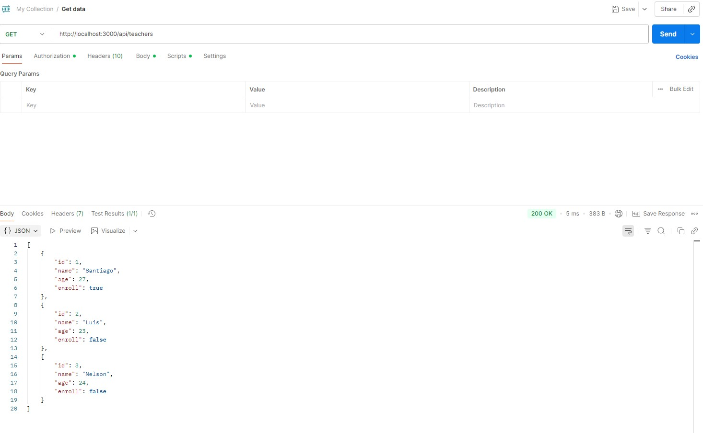

# **API para Gestión de Teachers**

## **Descripción del Proyecto**

Este proyecto consiste en una **API RESTful** desarrollada con **Node.js** y **Express.js**, cuyo objetivo es permitir la gestión de información de profesores (teachers).  
El proyecto está diseñado para demostrar la correcta implementación de buenas prácticas de desarrollo backend, incluyendo:

- **Seguridad** mediante autenticación básica.  
- **Pruebas automatizadas** para asegurar la calidad del código.  
- **Integración y Despliegue Continuos (CI/CD)** con GitHub Actions para automatizar el flujo de desarrollo.  

La API permite realizar operaciones CRUD (Crear, Leer, Actualizar y Eliminar) sobre el recurso **Teacher**, manteniendo la modularidad y escalabilidad del proyecto.  
Se enfoca en la separación de responsabilidades y la organización del código, lo que facilita su mantenimiento y futuras expansiones.

---

## **Alcance y Objetivos**

### **Objetivo General**
El objetivo principal es desarrollar una API funcional, segura y escalable que permita la gestión completa de profesores, asegurando la autenticación de usuarios y la correcta ejecución de pruebas automatizadas antes de cualquier despliegue.

### **Objetivos Específicos**
- Implementar una **arquitectura modular y escalable**, separando rutas, middlewares, modelos y controladores para mejorar la mantenibilidad.  
- Incorporar **autenticación básica** para proteger los endpoints y evitar accesos no autorizados.  
- Configurar **pruebas automatizadas** usando Jest y Supertest para validar el comportamiento esperado de cada endpoint.  
- Establecer un **flujo de CI/CD** con GitHub Actions que garantice la integración continua y la entrega controlada de cambios.  
- Documentar de manera **técnica y profesional** todo el desarrollo de la API, incluyendo ejemplos, instrucciones de ejecución y diagramas de flujo.

---

## **Arquitectura del Proyecto**

### **Patrón de Arquitectura**
Se utiliza un patrón **MVC (Model-View-Controller) simplificado**, que permite organizar el proyecto en capas bien definidas y con responsabilidades separadas:

- **Rutas (`routes/`)**: Contienen la definición de los endpoints de la API y los métodos HTTP asociados.  
- **Middlewares (`middlewares/`)**: Implementan funciones intermedias como la **autenticación**, validación de datos y manejo de errores.  
- **Pruebas (`api.test.js`)**: Se encargan de realizar **tests automatizados** que verifican el comportamiento correcto de la API.  
- **Archivo principal (`index.js`)**: Inicializa el servidor, configura los middlewares y enlaza las rutas.  
- **Pipeline CI/CD (`.github/workflows/nodejs.yml`)**: Define las etapas de integración, pruebas y despliegue automatizado.

Esta arquitectura facilita la **extensibilidad**, permitiendo agregar nuevas funcionalidades sin afectar el código existente.

---

## **Tecnologías Utilizadas**

La API se desarrolla utilizando tecnologías modernas que garantizan eficiencia, escalabilidad y seguridad:

| Categoría | Herramienta o Librería | Descripción |
|------------|------------------------|-------------|
| Lenguaje de programación | JavaScript (Node.js) | Plataforma para ejecutar código JavaScript en el servidor. |
| Framework | Express.js | Framework minimalista para construir aplicaciones web y APIs RESTful. |
| Pruebas automatizadas | Jest, Supertest | Permiten realizar pruebas unitarias y de integración de los endpoints. |
| Control de versiones | Git / GitHub | Gestión del código fuente y colaboración entre desarrolladores. |
| Integración y despliegue | GitHub Actions | Automatización del flujo de trabajo para pruebas y despliegue continuo. |
| Autenticación | Basic Authentication personalizada | Seguridad de acceso a los endpoints mediante usuario y contraseña codificados en Base64. |

---

## **Seguridad y Buenas Prácticas**

Para garantizar la **seguridad y confiabilidad** de la API, se implementaron las siguientes prácticas:

- **Autenticación básica** mediante middleware, protegiendo todos los endpoints.  
- **Validación de datos** recibidos en las solicitudes para evitar inconsistencias o ataques de inyección.  
- **Manejo de errores controlado**, devolviendo códigos HTTP estandarizados según la situación (200, 400, 404, 500).  
- **Dependencias actualizadas** para evitar vulnerabilidades conocidas.  
- **Pruebas automatizadas** antes de cada despliegue para asegurar que los cambios no rompan funcionalidades existentes.  

---

## **Endpoints Principales**

La API ofrece los siguientes endpoints para la gestión de profesores:

| Método | Ruta | Descripción | Autenticación |
|--------|------|--------------|---------------|
| GET | `/api/teachers` | Obtiene todos los profesores registrados. | Sí |
| GET | `/api/teachers/:id` | Obtiene la información de un profesor específico mediante su ID. | Sí |
| POST | `/api/teachers` | Permite crear un nuevo profesor en el sistema. | Sí |
| PUT | `/api/teachers/:id` | Actualiza la información de un profesor existente. | Sí |
| DELETE | `/api/teachers/:id` | Elimina un profesor del sistema. | Sí |

### **Autenticación**
Todos los endpoints requieren autenticación básica:  
admin 
1234

## **Pruebas Automatizadas**

Se utilizan **Jest** y **Supertest** para garantizar la correcta funcionalidad de los endpoints.  
Estas pruebas permiten detectar errores de manera temprana y asegurar la estabilidad de la API durante el desarrollo.

### **Ejemplo de pruebas**

### **PIPELINE**

Build: Instalación de dependencias y ejecución de pruebas automatizadas.

Validación: Confirmación de que todas las pruebas pasaron correctamente.

Deploy: Simulación de despliegue local de la API en caso de éxito.

---
## **Pruebas Postman**

## METODO GET

## METODO GET COMPLETA TABLA

## AUTENTICACION

## METODO POST

## GET DESPUES DEL POST

---

## **AUTORIA**
Autor: Danny Diaz
GITHUB

### **CONCLUSION**

Código modular y escalable.

Implementación de autenticación segura en todos los endpoints.

Automatización del flujo de desarrollo mediante CI/CD.

Pruebas unitarias y de integración exitosas.

Documentación técnica completa y clara, facilitando la comprensión y mantenimiento del proyecto.

